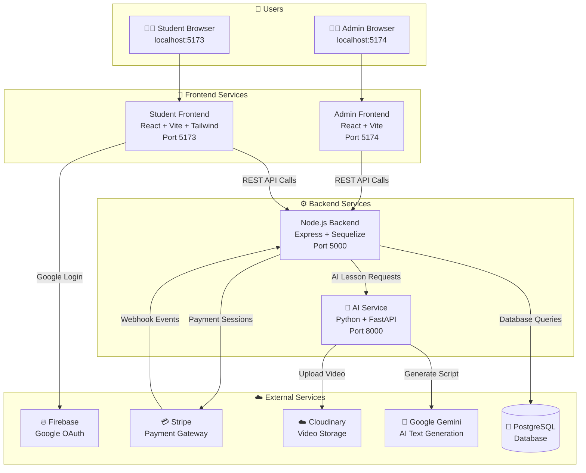
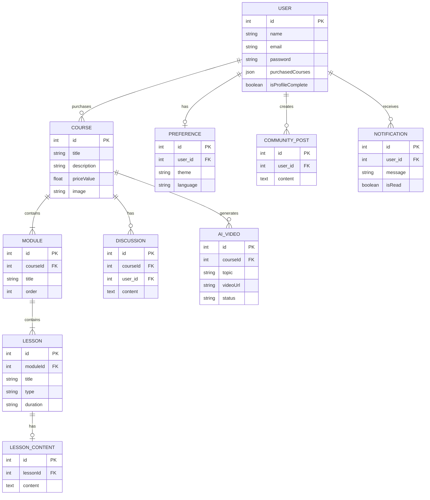
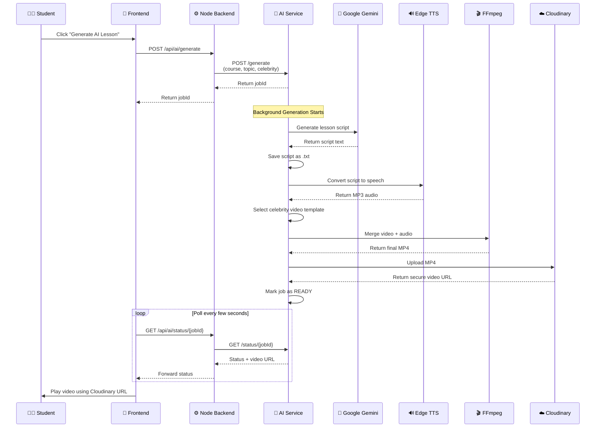
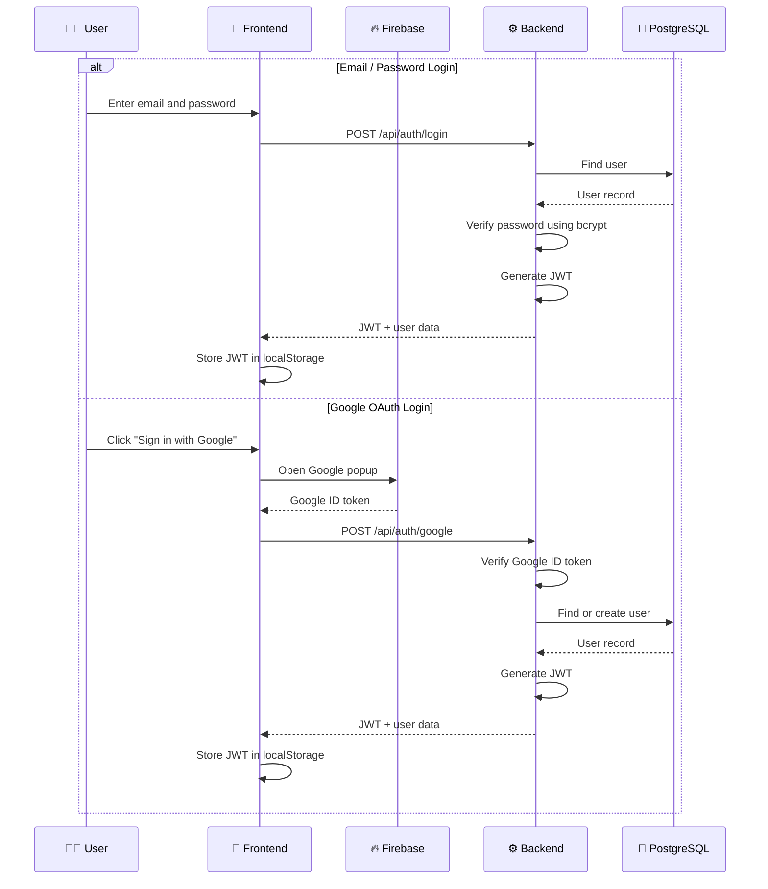
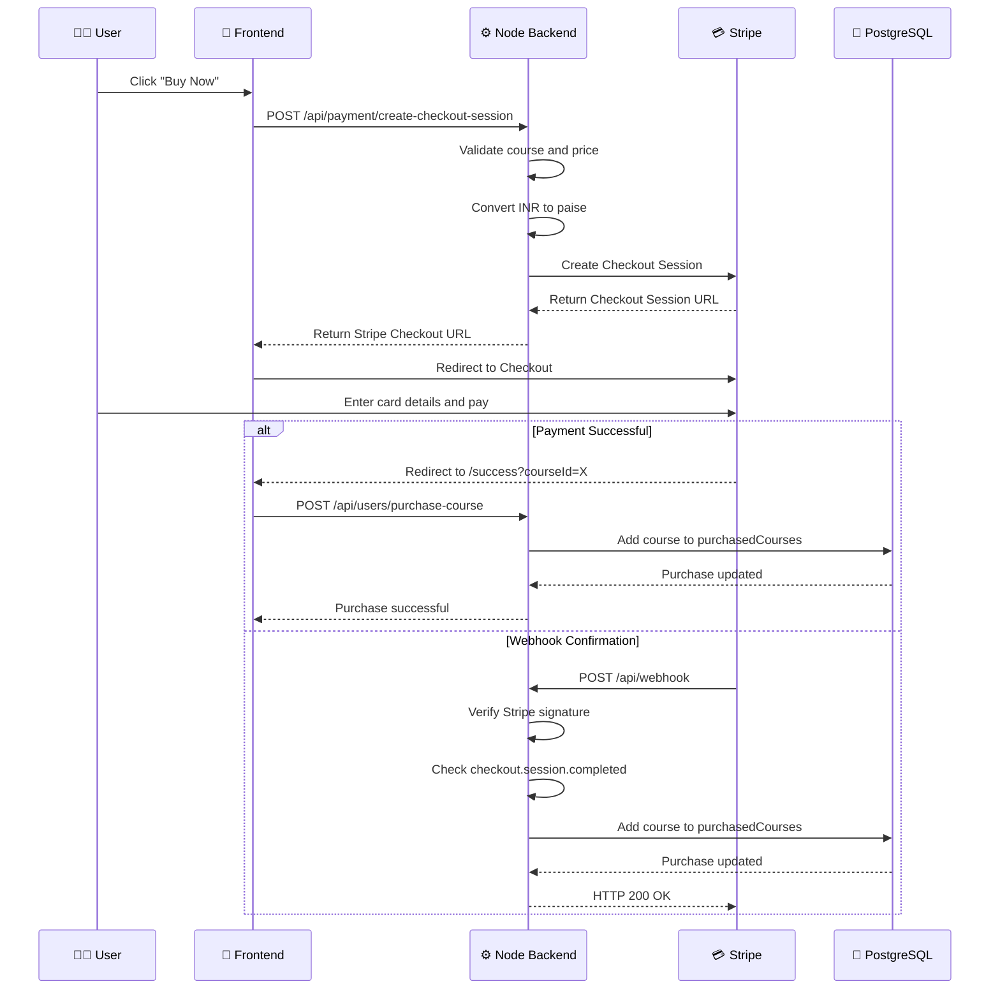

## High-Level System Architecture

```mermaid
graph TB

    subgraph USERS["👥 Users"]
        Student["👨‍🎓 Student Browser<br/>localhost:5173"]
        Admin["👨‍💼 Admin Browser<br/>localhost:5174"]
    end

    subgraph FRONTEND["📱 Frontend Services"]
        FE["Student Frontend<br/>React + Vite + Tailwind<br/>Port 5173"]
        FA["Admin Frontend<br/>React + Vite<br/>Port 5174"]
    end

    subgraph BACKEND["⚙️ Backend Services"]
        BE["Node.js Backend<br/>Express + Sequelize<br/>Port 5000"]
        AI["🤖 AI Service<br/>Python + FastAPI<br/>Port 8000"]
    end

    subgraph EXTERNAL["☁️ External Services"]
        DB[("🐘 PostgreSQL<br/>Database")]
        Stripe["💳 Stripe<br/>Payment Gateway"]
        Firebase["🔥 Firebase<br/>Google OAuth"]
        Cloudinary["☁️ Cloudinary<br/>Video Storage"]
        Gemini["🧠 Google Gemini<br/>AI Text Generation"]
    end

    Student --> FE
    Admin --> FA

    FE -->|"REST API Calls"| BE
    FA -->|"REST API Calls"| BE

    BE -->|"Database Queries"| DB
    BE -->|"AI Lesson Requests"| AI
    BE -->|"Payment Sessions"| Stripe

    FE -->|"Google Login"| Firebase

    AI -->|"Generate Script"| Gemini
    AI -->|"Upload Video"| Cloudinary

    Stripe -->|"Webhook Events"| BE
```

## Database ER Diagram

```mermaid
erDiagram

    USER ||--o{ COURSE : purchases
    USER ||--o| PREFERENCE : has
    USER ||--o{ COMMUNITY_POST : creates
    USER ||--o{ NOTIFICATION : receives

    COURSE ||--|{ MODULE : contains
    MODULE ||--|{ LESSON : contains
    LESSON ||--o| LESSON_CONTENT : has

    COURSE ||--o{ DISCUSSION : has
    COURSE ||--o{ AI_VIDEO : generates

    USER {
        int id PK
        string name
        string email
        string password
        json purchasedCourses
        boolean isProfileComplete
    }

    COURSE {
        int id PK
        string title
        string description
        float priceValue
        string image
    }

    MODULE {
        int id PK
        int courseId FK
        string title
        int order
    }

    LESSON {
        int id PK
        int moduleId FK
        string title
        string type
        string duration
    }

    LESSON_CONTENT {
        int id PK
        int lessonId FK
        text content
    }

    PREFERENCE {
        int id PK
        int user_id FK
        string theme
        string language
    }

    COMMUNITY_POST {
        int id PK
        int user_id FK
        text content
    }

    NOTIFICATION {
        int id PK
        int user_id FK
        string message
        boolean isRead
    }

    DISCUSSION {
        int id PK
        int courseId FK
        int user_id FK
        text content
    }

    AI_VIDEO {
        int id PK
        int courseId FK
        string topic
        string videoUrl
        string status
    }
```

## AI Video Generation Pipeline

```mermaid
sequenceDiagram

    participant Student as 👨‍🎓 Student
    participant FE as 📱 Frontend
    participant BE as ⚙️ Node Backend
    participant AI as 🤖 AI Service
    participant Gemini as 🧠 Google Gemini
    participant TTS as 🔊 Edge TTS
    participant FFmpeg as 🎬 FFmpeg
    participant Cloud as ☁️ Cloudinary

    Student->>FE: Click "Generate AI Lesson"

    FE->>BE: POST /api/ai/generate

    BE->>AI: POST /generate<br/>(course, topic, celebrity)

    AI-->>BE: Return jobId

    BE-->>FE: Return jobId

    Note over AI: Background Generation Starts

    AI->>Gemini: Generate lesson script
    Gemini-->>AI: Return script text

    AI->>AI: Save script as .txt

    AI->>TTS: Convert script to speech
    TTS-->>AI: Return MP3 audio

    AI->>AI: Select celebrity video template

    AI->>FFmpeg: Merge video + audio
    FFmpeg-->>AI: Return final MP4

    AI->>Cloud: Upload MP4
    Cloud-->>AI: Return secure video URL

    AI->>AI: Mark job as READY

    loop Poll every few seconds
        FE->>BE: GET /api/ai/status/{jobId}
        BE->>AI: GET /status/{jobId}
        AI-->>BE: Status + video URL
        BE-->>FE: Forward status
    end

    FE->>Student: Play video using Cloudinary URL
```

## Authentication Flow

```mermaid
sequenceDiagram

    participant User as 👨‍🎓 User
    participant FE as 📱 Frontend
    participant Firebase as 🔥 Firebase
    participant BE as ⚙️ Backend
    participant DB as 🐘 PostgreSQL

    alt Email / Password Login

        User->>FE: Enter email and password

        FE->>BE: POST /api/auth/login

        BE->>DB: Find user

        DB-->>BE: User record

        BE->>BE: Verify password using bcrypt

        BE->>BE: Generate JWT

        BE-->>FE: JWT + user data

        FE->>FE: Store JWT in localStorage

    else Google OAuth Login

        User->>FE: Click "Sign in with Google"

        FE->>Firebase: Open Google popup

        Firebase-->>FE: Google ID token

        FE->>BE: POST /api/auth/google

        BE->>BE: Verify Google ID token

        BE->>DB: Find or create user

        DB-->>BE: User record

        BE->>BE: Generate JWT

        BE-->>FE: JWT + user data

        FE->>FE: Store JWT in localStorage

    end
```

## Stripe Payment Flow

```mermaid
sequenceDiagram

    participant User as 👨‍🎓 User
    participant FE as 📱 Frontend
    participant BE as ⚙️ Node Backend
    participant Stripe as 💳 Stripe
    participant DB as 🐘 PostgreSQL

    User->>FE: Click "Buy Now"

    FE->>BE: POST /api/payment/create-checkout-session

    BE->>BE: Validate course and price
    BE->>BE: Convert INR to paise

    BE->>Stripe: Create Checkout Session

    Stripe-->>BE: Return Checkout Session URL

    BE-->>FE: Return Stripe Checkout URL

    FE->>Stripe: Redirect to Checkout

    User->>Stripe: Enter card details and pay

    alt Payment Successful

        Stripe-->>FE: Redirect to /success?courseId=X

        FE->>BE: POST /api/users/purchase-course

        BE->>DB: Add course to purchasedCourses

        DB-->>BE: Purchase updated

        BE-->>FE: Purchase successful

    else Webhook Confirmation

        Stripe->>BE: POST /api/webhook

        BE->>BE: Verify Stripe signature

        BE->>BE: Check checkout.session.completed

        BE->>DB: Add course to purchasedCourses

        DB-->>BE: Purchase updated

        BE-->>Stripe: HTTP 200 OK

    end
```
