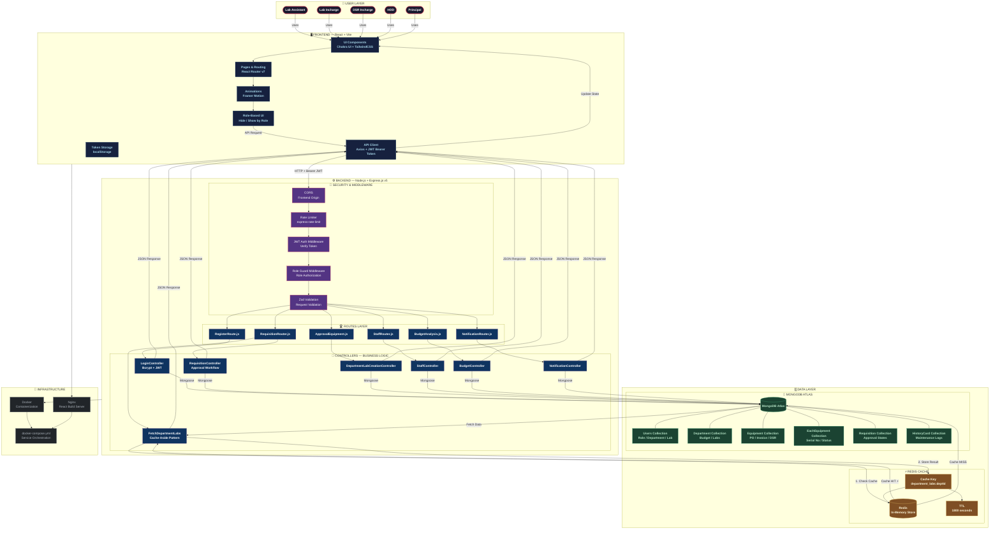

```mermaid
flowchart TD

    %% ================================
    %% STYLES
    %% ================================

    classDef userStyle fill:#1a1a2e,stroke:#e94560,color:#fff,font-weight:bold
    classDef frontendStyle fill:#16213e,stroke:#0f3460,color:#a8d8ea,font-weight:bold
    classDef backendStyle fill:#0f3460,stroke:#533483,color:#fff,font-weight:bold
    classDef middlewareStyle fill:#533483,stroke:#e94560,color:#fff
    classDef dbStyle fill:#1b4332,stroke:#52b788,color:#b7e4c7,font-weight:bold
    classDef cacheStyle fill:#7f4f24,stroke:#e9c46a,color:#fefae0,font-weight:bold
    classDef infraStyle fill:#212529,stroke:#6c757d,color:#adb5bd

    %% ================================
    %% USER LAYER
    %% ================================

    subgraph USER["👤 USER LAYER"]
        U1(["Lab Assistant"])
        U2(["Lab Incharge"])
        U3(["DSR Incharge"])
        U4(["HOD"])
        U5(["Principal"])
    end

    %% ================================
    %% FRONTEND
    %% ================================

    subgraph FRONTEND["🖥️ FRONTEND — React + Vite"]

        FE1["UI Components<br/>Chakra UI + TailwindCSS"]

        FE2["Pages & Routing<br/>React Router v7"]

        FE3["Animations<br/>Framer Motion"]

        FE4["Role-Based UI<br/>Hide / Show by Role"]

        FE5["API Client<br/>Axios + JWT Bearer Token"]

        FE6["Token Storage<br/>localStorage"]
    end

    %% ================================
    %% BACKEND
    %% ================================

    subgraph BACKEND["⚙️ BACKEND — Node.js + Express.js v5"]

        subgraph SECURITY["🔐 SECURITY & MIDDLEWARE"]

            MW1["CORS<br/>Frontend Origin"]

            MW2["Rate Limiter<br/>express-rate-limit"]

            MW3["JWT Auth Middleware<br/>Verify Token"]

            MW4["Role Guard Middleware<br/>Role Authorization"]

            MW5["Zod Validation<br/>Request Validation"]

        end

        subgraph ROUTES["🛣️ ROUTES LAYER"]

            R1["RegisterRoute.js"]

            R2["RequisitionRouter.js"]

            R3["StaffRouter.js"]

            R4["ApprovalEquipment.js"]

            R5["BudgetAnalysis.js"]

            R6["NotificationRouter.js"]

        end

        subgraph CONTROLLERS["🧠 CONTROLLERS — BUSINESS LOGIC"]

            C1["LoginController<br/>Bcrypt + JWT"]

            C2["RequisitionController<br/>Approval Workflow"]

            C3["DepartmentLabCreationController"]

            C4["StaffController"]

            C5["BudgetController"]

            C6["NotificationController"]

            C7["FetchDepartmentLabs<br/>Cache-Aside Pattern"]

        end
    end

    %% ================================
    %% DATA LAYER
    %% ================================

    subgraph DATA["🗄️ DATA LAYER"]

        subgraph CACHE["⚡ REDIS CACHE"]

            RD1[("Redis<br/>In-Memory Store")]

            RD2["Cache Key<br/>department_labs:deptId"]

            RD3["TTL<br/>1800 seconds"]

        end

        subgraph DATABASE["🍃 MONGODB ATLAS"]

            DB1[("MongoDB Atlas")]

            DB2["Users Collection<br/>Role / Department / Lab"]

            DB3["Department Collection<br/>Budget / Labs"]

            DB4["Equipment Collection<br/>PO / Invoice / DSR"]

            DB5["EachEquipment Collection<br/>Serial No / Status"]

            DB6["Requisition Collection<br/>Approval States"]

            DB7["HistoryCard Collection<br/>Maintenance Logs"]

        end
    end

    %% ================================
    %% INFRASTRUCTURE
    %% ================================

    subgraph INFRA["🚀 INFRASTRUCTURE"]

        I1["Docker<br/>Containerization"]

        I2["docker-compose.yml<br/>Service Orchestration"]

        I3["Nginx<br/>React Build Server"]

    end

    %% ================================
    %% USER → FRONTEND
    %% ================================

    U1 -->|"Uses"| FE1
    U2 -->|"Uses"| FE1
    U3 -->|"Uses"| FE1
    U4 -->|"Uses"| FE1
    U5 -->|"Uses"| FE1

    %% ================================
    %% FRONTEND FLOW
    %% ================================

    FE1 --> FE2
    FE2 --> FE3
    FE3 --> FE4

    FE4 -->|"API Request"| FE5

    FE5 -->|"HTTP + Bearer JWT"| MW1

    %% ================================
    %% SECURITY FLOW
    %% ================================

    MW1 --> MW2
    MW2 --> MW3
    MW3 --> MW4
    MW4 --> MW5

    %% ================================
    %% ROUTING
    %% ================================

    MW5 --> R1
    MW5 --> R2
    MW5 --> R3
    MW5 --> R4
    MW5 --> R5
    MW5 --> R6

    %% ================================
    %% ROUTE → CONTROLLER
    %% ================================

    R1 --> C1
    R2 --> C2
    R2 --> C7
    R3 --> C4
    R4 --> C3
    R5 --> C5
    R6 --> C6

    %% ================================
    %% REDIS CACHE-ASIDE FLOW
    %% ================================

    C7 -->|"1. Check Cache"| RD1

    RD1 -->|"Cache HIT ⚡"| C7

    RD1 -->|"Cache MISS"| DB1

    DB1 -->|"Fetch Data"| C7

    C7 -->|"2. Store Result"| RD2

    RD2 --> RD3

    RD2 --> RD1

    %% ================================
    %% CONTROLLERS → DATABASE
    %% ================================

    C1 -->|"Mongoose"| DB1
    C2 -->|"Mongoose"| DB1
    C3 -->|"Mongoose"| DB1
    C4 -->|"Mongoose"| DB1
    C5 -->|"Mongoose"| DB1
    C6 -->|"Mongoose"| DB1

    %% ================================
    %% DATABASE COLLECTIONS
    %% ================================

    DB1 --- DB2
    DB1 --- DB3
    DB1 --- DB4
    DB1 --- DB5
    DB1 --- DB6
    DB1 --- DB7

    %% ================================
    %% RESPONSE FLOW
    %% ================================

    C1 -->|"JSON Response"| FE5
    C2 -->|"JSON Response"| FE5
    C3 -->|"JSON Response"| FE5
    C4 -->|"JSON Response"| FE5
    C5 -->|"JSON Response"| FE5
    C6 -->|"JSON Response"| FE5
    C7 -->|"JSON Response"| FE5

    FE5 -->|"Update State"| FE1

    %% ================================
    %% INFRASTRUCTURE
    %% ================================

    FRONTEND --> I3

    BACKEND --> I1

    I1 --> I2
    I3 --> I2

    %% ================================
    %% APPLY STYLES
    %% ================================

    class U1,U2,U3,U4,U5 userStyle

    class FE1,FE2,FE3,FE4,FE5,FE6 frontendStyle

    class MW1,MW2,MW3,MW4,MW5 middlewareStyle

    class R1,R2,R3,R4,R5,R6 backendStyle

    class C1,C2,C3,C4,C5,C6,C7 backendStyle

    class DB1,DB2,DB3,DB4,DB5,DB6,DB7 dbStyle

    class RD1,RD2,RD3 cacheStyle

    class I1,I2,I3 infraStyle
```
